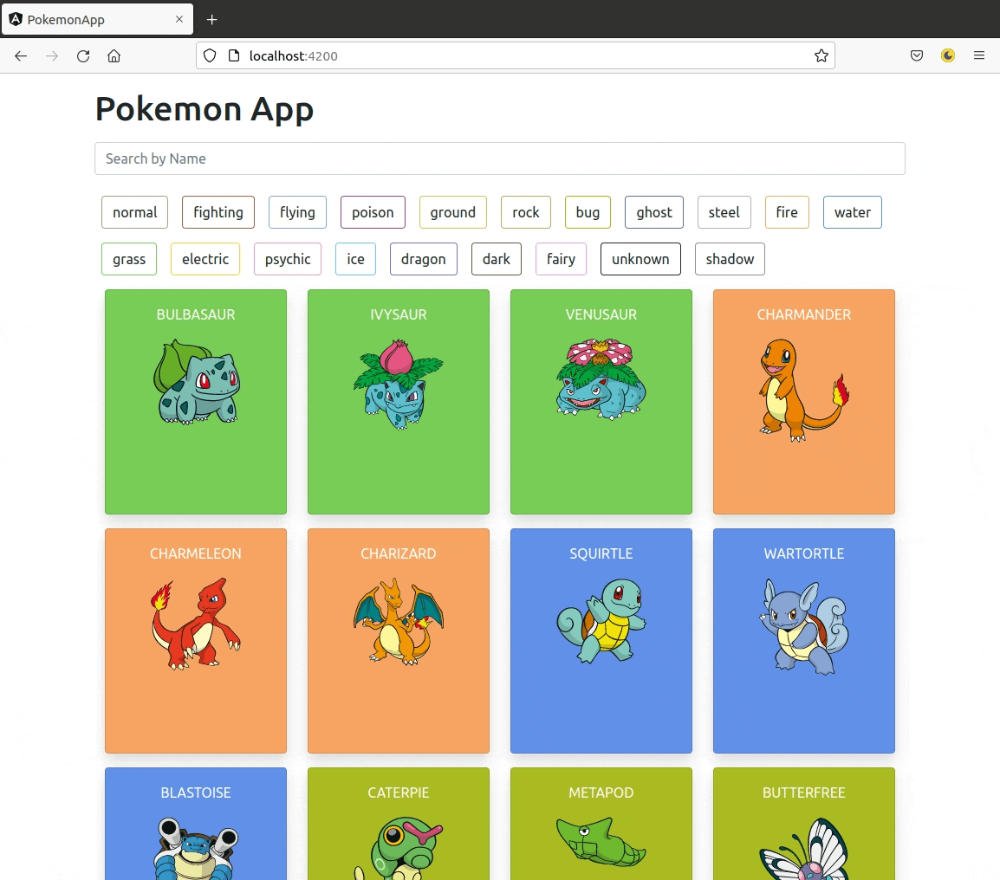

# Pokemon App

The Pokemon App is an Angular application that uses the [Poke API](https://pokeapi.co/) to load and filter through Pokemon Cards. This is Challenge #4 from [NUWE's IT Academy - Lliga de Programació](https://nuwe.io/event/it-academy-liga-de-programacion).

## **Preview**

## 

---

## :wrench: **Tech used in this project**

In this project I used Angular and Boostrap5 to develop a web app that initially loads 24 Pokemon Cards with Angular's Http Client and upon clicking any of the cards the user is presented with basic stats, specie's information, and evolution chain of the chosen Pokemon. The front page allows users to search by name of the loaded Pokemon and to filter Pokemons by types with different tag toggles. The background color of the cards as well as the border colors of the tags correspond to the 20 different pokemon types with Angular's NG class directive and conditional styling. The site is fully-responsive through the use of Bootstrap5 breakpoints.

---

## :mortar_board: **What did I learn from this project**

In this project I learned how to handle multiple API calls asynchronously, and how to implement filtering processes through string search and toggling tags. These filtering processes were developed in separate components with data shared through Angular services.
Also due to the breadth of the Pokemon APIs with a large hierarchy of nested objects, I learned how to break down the accessing of information, and to logically create intermittent API calls once an earlier API call finished.

---

## :memo: **What do I still need to do**

1. Load additional Pokemon card through bottom "Load More Pokemons" button or implementing infinite scrolling.

2. Global search function that allows user to search all possible Pokemons rather than just the loaded Pokemons.

3. Implement unit tests to ensure filtering function works exactly as intended.

4. Additional styling to cards.

5. Refactor the code.

---

## :seedling: **Getting Started with this project**

This project was generated with [Angular CLI](https://github.com/angular/angular-cli) version 14.0.1.

## Development server

Run `ng serve` for a dev server. Navigate to `http://localhost:4200/`. The application will automatically reload if you change any of the source files.

## Installation

Clone or fork the Repo, and ensure that you have the [Angular CLI](https://github.com/angular/angular-cli) installed.

In the project directory.

```bash
npm install
```

In the project directory.

```bash
ng serve --open
```

## :bookmark_tabs: **Usage Instructions**

Upon starting live server, 24 Pokemon cards will load. type in the name of the Pokemon you want to find in the search field, and the page will change accordingly to find your match. Click on any of the tags below to filter the pokemon by its type.
Click on any of the cards to view that Pokemon's stats.

## Contributing

Pull requests are welcome. For major changes, please open an issue first to discuss what you would like to change.

Please make sure to update tests as appropriate.

## License

[MIT](https://choosealicense.com/licenses/mit/)
